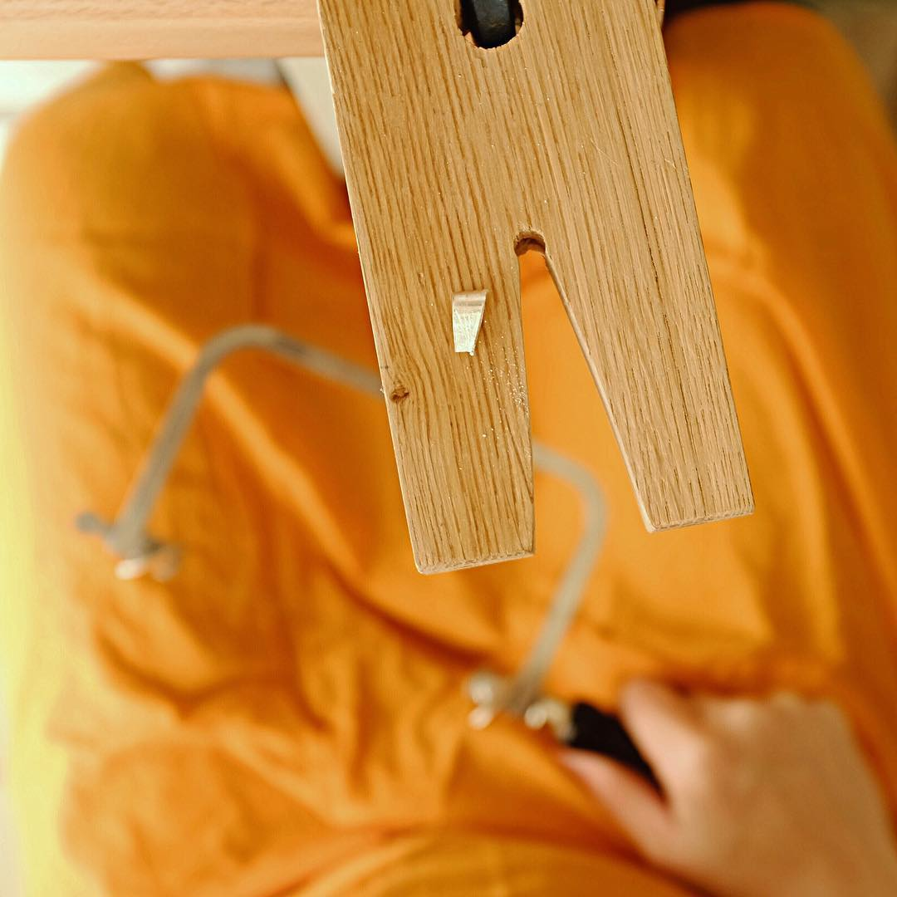

<!-- Banner -->
<section id="banner">
    

        <header>
            <h1>Hi, I’m K</h1>
            
and I'm a Maker

        </header>
        
Aenean ornare velit lacus, ac varius enim ullamcorper eu. Proin aliquam 		facilisis ante interdum congue.
            Integer mollis, nisl amet convallis, porttitor magna ullamcorper, amet egestas mauris. Ut magna finibus nisi
            nec lacinia. Nam maximus erat id euismod egestas. Pellentesque sapien ac quam. Lorem ipsum dolor sit nullam.
        

    

    
        
    
</section>

<!-- Section -->
<section>
	<header class="major">
		<h2>Recent posts</h2>
	</header>
	

		
			<article>
			    
						
				

				{{ post.date | date: "%b %-d, %Y" }}
				<h3>{{ post.title }}</h3>
				
{{ post.excerpt }}

				<ul class="actions">
					<li><a href="{{ post.url }}" class="button">More</a></li>
				</ul>
			</article>
		
	

</section>

	
    
	  |  
    <a href="/tags/{{ tag[0] | slugify}}" 
    style="font-size: {{ tag[1] | size | times: 2 | plus: 10 }}px">{{ tag[0] }}</a>
    

